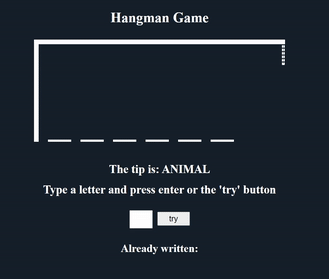

    

## Description
This is a basic CSS and JavaScript Hangman Game.

It gets the words and tips from the words.js and choose one randomly and builds a number of dashes equivalent to the number of letters in the word. If the guess is a letter that occurs in the word, the game fills in the blanks with that letter in the right places. If the word does not contain the suggested letter, the other player draws one element of the stickman. The game ends when the player guess all the letters or when the stickman is fully drawn.